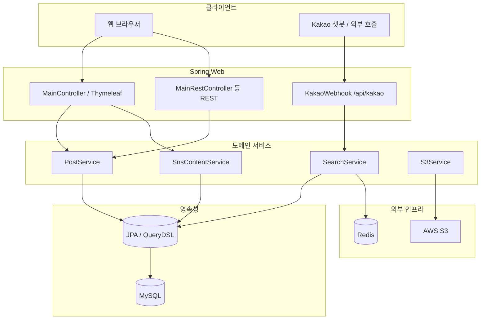
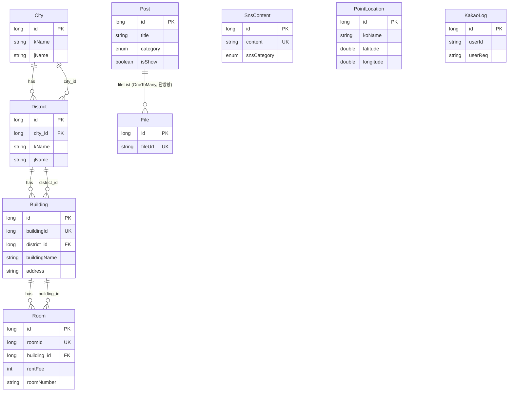
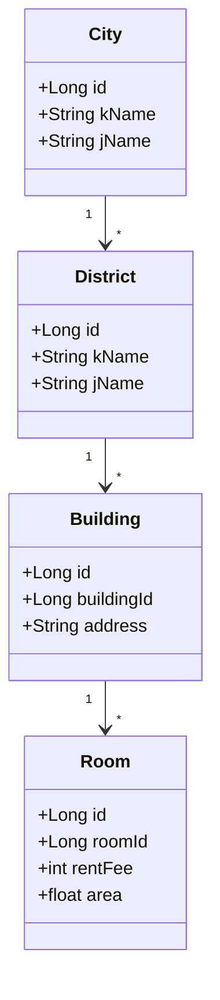

# Houber Japan Life (houber-japanlife)

일본 생활·부동산 정보를 제공하는 **하우버(Houber)** 웹 서비스와, 카카오 챗봇 연동 **매물 검색·상세 응답**을 담은 Spring Boot 애플리케이션입니다. 프로젝트는 종료되었으며, 본 문서는 구조·목표·데이터 설계를 보존하기 위한 기록입니다.

---

## 1. 프로젝트 목표와 구조

### 목표

- **정보 콘텐츠 허브**: 일본 리뷰·이벤트·부동산 가이드·워킹홀리데이·일상 정보 등 카테고리별 게시글을 제공하고, 목록·검색·상세·목차(TOC)로 읽기 경험을 구성합니다.
- **SNS 연동 콘텐츠**: YouTube 등 SNS 기반 콘텐츠를 별도 엔티티로 관리하고 상세 페이지로 노출합니다.
- **부동산 검색(카카오 봇)**: `City` → `District` → `Building` → `Room` 계층과 지도 포인트(`PointLocation`)를 바탕으로 QueryDSL 기반 검색·필터링 및 카카오 웹훅 API(`/api/kakao/*`)로 응답합니다.
- **운영 기능**: AWS S3 업로드, RSS·사이트맵, Redis·GPT 연동 등 보조 기능을 포함합니다.

### 기술 스택 (요약)

| 구분 | 내용 |
|------|------|
| 런타임 | Java 17, Spring Boot 3.2.x |
| 웹 | Spring MVC, Thymeleaf |
| 데이터 | Spring Data JPA, QueryDSL, MySQL |
| 캐시·기타 | Redis, Jsoup, AWS SDK(S3), Jasypt(설정 암호화) |

### 디렉터리 구조 (패키지)

```
src/main/java/com/lee/osakacity/
├── OsakaCityApplication.java          # 진입점
├── controller/                         # Thymeleaf 페이지, REST, S3, SNS, 에러
├── service/                            # Post, Sns, S3, Sitemap 등
├── infra/
│   ├── entity/                         # Post, File, SnsContent (콘텐츠 도메인)
│   └── repository/                   # JPA 리포지토리
├── dto/                                # MVC·REST 응답/요청 DTO
├── custom/                             # Category, SnsCategory 등 enum
├── config/                             # Web, AWS, QueryDSL, Multipart 등
└── scrap/                              # 스크래핑 관련

src/main/java/com/lee/osakacity/ai/
├── controller/                         # KakaoWebhook, RealController, DataSearcher 등
├── service/                            # SearchService, GptService, RedisService, RealProService
├── infra/                              # 부동산·지도·로그 엔티티 및 repo
├── dto/                                # 카카오 봇, Room/Building DTO, 커스텀 enum
└── config/                             # Redis, RealNet 연동 등
```

정적 리소스·템플릿은 `src/main/resources/static`, `templates`에 있습니다.

### 애플리케이션 계층(논리 뷰)

리포지토리에 별도 UML 산출물이 없으므로, **구성 요소 관계**를 다음 다이어그램으로 요약합니다.



---

## 2. UML 관점 정리 및 엔티티 설계

### 2.1 엔티티 관계(ERD)

JPA `@Entity` 기준 **주요 연관**은 아래와 같습니다. (`Post` ↔ `File`은 `Post` 쪽 `OneToMany`만 정의되어 있고 `File`에 역참조 필드는 없는 **단방향** 관계입니다.)



### 2.2 엔티티 역할 요약

| 엔티티 | 패키지 | 역할 |
|--------|--------|------|
| **City** | `ai.infra` | 상위 지역. `District` 목록 보유. |
| **District** | `ai.infra` | `City` 소속, `Building` 목록 보유. |
| **Building** | `ai.infra` | `District` 소속 건물, 외부 `buildingId`·주소·노선 등, `Room` 컬렉션. |
| **Room** | `ai.infra` | `Building` 소속 호실. 임대료·관리비·면적·상태(`Status`)·평형(`RoomType`)·구조(`Structure`)·이미지 URL 등. |
| **PointLocation** | `ai.infra` | 지도/핀용 한·일 명칭 및 위경도. |
| **KakaoLog** | `ai.infra` | 카카오 사용자 요청·응답 블록명 등 로그. |
| **Post** | `infra.entity` | 사이트 메인 콘텐츠 게시글. `Category`(리뷰·이벤트·부동산·워홀·일상 등), 조회수, 노출 여부, 첨부 `File` 목록. 생성·수정 시각 감사. |
| **File** | `infra.entity` | 업로드 파일 메타데이터(URL·파일명·alt·사용 여부). |
| **SnsContent** | `infra.entity` | SNS(예: YouTube) 콘텐츠. 썸네일·조회수·고유 `content` 식별자 등. |

### 2.3 부록: 클래스 다이어그램(부동산 도메인 핵심)



---

## 빌드 및 실행 (참고)

- **빌드**: `./gradlew build` (Windows: `gradlew.bat build`)
- **실행**: `./gradlew bootRun`
- **의존 환경**: MySQL, Redis, AWS S3 및 `application.yml`의 암호화 키(Jasypt)가 런타임에 필요합니다.

---

*본 README는 종료 시점 코드베이스(`com.lee.osakacity`)를 기준으로 작성되었습니다.*
